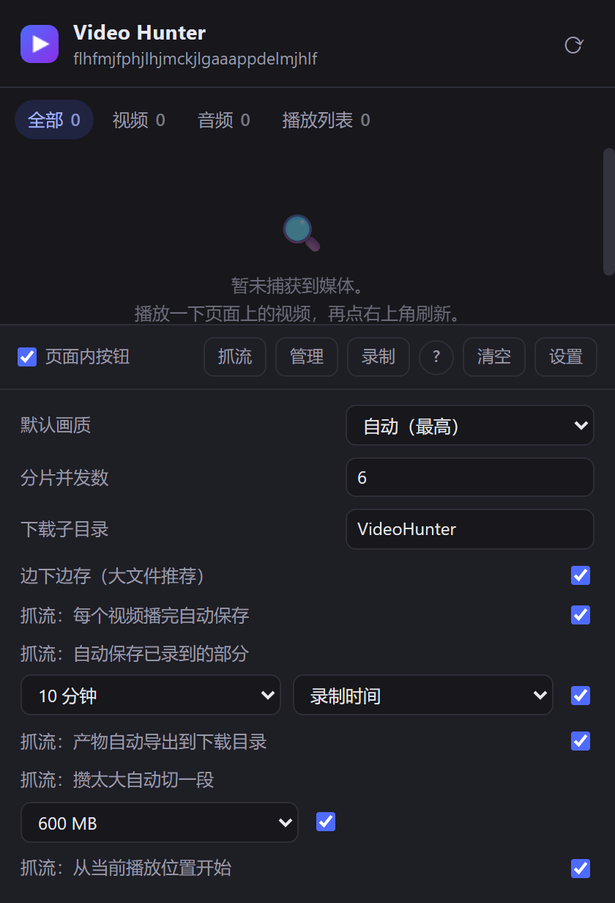

# Video Hunter

一个 Chrome / Edge (Manifest V3) 扩展：**嗅探网页上的媒体 → 下载 → 合并成能直接播的 MP4**。
地址拿不到的时候（页面自己解密、或者流太碎）还有两条兜底 —— **抓流**（钩播放器的
`appendBuffer`，拿它**已经解密好**、正要交给 `SourceBuffer` 的原始码流，无损不重编码）
和**录制**。全流程在本机完成，不经过任何服务器。

它把 [猫抓](https://github.com/xifangczy/cat-catch)（嗅探 + M3U8 解析）和
[CocoCut](https://chromewebstore.google.com/detail/ekhbcipncbkfpkaianbjbcbmfehjflpf)（流下载）
那类工具的能力合成一体，并补上它们各自缺的那块 —— **抓不到流地址时的抓流与录制兜底**。

<p align="center">
  
</p>

当前版本 **0.2.1** ｜ 改了什么见 [CHANGELOG.md](CHANGELOG.md) ｜ 验证记录见 [docs/verification.md](docs/verification.md)

> 当前状态：**HLS 与 DASH 两条主链路都已在真实 Chrome 里端到端验证通过**（产物经 ffprobe 反验，并用 Apple 的公开 HLS 测试流压过分离音轨场景）。录制链路已实现但尚未在真实站点上跑过。请先读下面的[能力边界](#能力边界先读这段)，再读 [验证报告](docs/verification.md) 里「没有验证的部分」那一节。

> **用途与免责**：这是个**个人自用工具**，请只用在你**有权获取**的内容上 —— 自己的录像、
> 有公开授权的素材、站点条款允许下载的内容。它**不绕过任何 DRM / 加密保护**：
> 遇到受保护内容会明确报错停下并说明原因（见下）。拿它去下载付费课程、会员内容再分发，
> 是**使用者自己**与站点、版权方之间的事 —— 作者不为此承担任何责任，
> 也不提供任何"针对某个特定站点"的破解支持。许可证是 [MIT](LICENSE)。

**目录**：[能力边界](#能力边界先读这段) ｜ [运行环境与推荐设置](#运行环境与推荐设置) ｜ [功能](#功能) ｜ [安装](#安装) ｜ [怎么用](#怎么用) ｜ [技术选择](#技术选择) ｜ [目录结构](#目录结构) ｜ [开发](#开发) ｜ [已知限制](#已知限制) ｜ [路线图](#路线图) ｜ [许可](#许可)

---

## 能力边界（先读这段）

这三件事能力差别极大，混在一起谈就会做出错误承诺：

| 情况 | 能不能做 | 为什么 |
| --- | --- | --- |
| **明文 HLS / MP4 / 普通直链** | ✅ 能 | 地址就在网络请求里 |
| **AES-128 加密的 HLS** | ✅ 能 | key 就在播放列表的 `#EXT-X-KEY` 里明文给出，这不是"破解"，是照规范读取 |
| **AES-128 的 DASH clear-lead** | ✅ 能 | 同上 |
| **Widevine / PlayReady / FairPlay DRM** | ❌ **做不到** | key 在浏览器的 CDM 黑盒里，**连播放页自己的 JS 都拿不到** |
| **站点自定义混淆** | ⚠️ 一站一议 | 要看具体实现，没有通用解 |

**关于 DRM，本工具的态度是明确停下并告诉你原因，而不是给你一个假装能用的按钮。** 遇到 DRM 时解析器页会直接显示"这个流受 DRM 保护（Widevine），无法下载"，并解释为什么这是浏览器层面的不可能，而不是"本工具还没实现"。

还有一条容易被误解的：**录制兜底录不到 DRM 视频**。受保护内容走系统级硬件保护路径，录出来是黑屏。录制兜底解决的是"流太碎、地址拿不到"，不是"有 DRM"。

---

## 运行环境与推荐设置

**这个扩展是按 32 GB 内存的机器设计的。** 抓流的数据**全在内存里**（边播边收，收完才合并落盘），
收尾合并还要再要一整块（muxer 内部还会翻倍扩容）—— 实测抓到的数据超过 ~1 GB 基本就合不出来了。
下面这些默认值和推荐值都是从这条约束推出来的：

| 设置 | 推荐 | 为什么 |
| --- | --- | --- |
| 抓流：自动保存已录到的部分 | **5 分钟**（默认值） | 数据全在内存里，**间隔越短、出意外时丢的越少**；滚动覆盖只留最新一份，所以空间占用始终是一份 |
| 抓流：攒太大自动切一段 | 普通视频**留着开**（用不到）；4K / 高码率**必开** | 600 MB 阈值 ≈ 收尾合并时峰值 1.8 GB。**普通视频一集到不了 600 MB，开着也不会触发**（不会把你的文件切开）；4K 那种 10 分钟就 600 MB，不开就可能到最后全丢 |
| 切段阈值 | 32 GB 内存用 **600 MB**；内存小调到 **300 MB** | 峰值大约是阈值的 3 倍（拼好的分片 + 封装输出 + 原始分片会同时在内存里） |
| 抓流：产物自动导出到下载目录 | **开** | 产物先落在扩展私有存储里（OPFS），导出才真的落到磁盘 |

⚠️ **0.2.1 及更早的版本上，一旦触发「自动切一段」，第二段会没有声音**（借初始化段借错了）；
**0.2.2 已修**。在老版本上跑 4K / 大文件时：要么先升级，要么把「自动切一段」关掉、自己盯着点。
（来龙去脉见 [CHANGELOG.md](CHANGELOG.md) 的 0.2.2 与 [docs/verification.md](docs/verification.md) 第十五轮。）

内存实在紧张的话：把切段阈值调到 300 MB、自动保存调到 5 分钟，或者干脆走**录制**那条路
（它边录边落盘、内存占用恒定，代价是要重编码一次，而且必须是实时的）。

---

## 功能

| 功能 | 状态 |
| --- | --- |
| 媒体嗅探（webRequest 三事件合并，按标签页归档，记录 Referer/Origin） | ✅ **已验证**（含 Referer 捕获） |
| 普通直链视频 / 音频一键下载 | ✅ **已验证**（真实落盘） |
| 页面内 `<video>` 悬浮下载按钮 | ✅ **已验证**（DOM 里确认注入） |
| Referer 会话注入（declarativeNetRequest） | ✅ **已验证**（服务端确认收到改写后的头） |
| HLS 主列表 → 画质选择（默认最高，可设档位） | ✅ **已验证** |
| TS 分片并发下载 → mux.js 重封装 → MP4 | ✅ **已验证** |
| AES-128 解密（含 IV 按分片序号推导） | ✅ **已验证** |
| fMP4 版 HLS 直接拼接 | ✅ **已验证** |
| **直播 HLS**（无 `#EXT-X-ENDLIST`，滑动窗口增量拉取） | ✅ **已验证**（TS 直播：收尾组装成带索引的标准 MP4。**fMP4 直播是分片式产物、拖不动**，界面会明说 —— 见下文） |
| **DASH / MPD**（画质选择 + 音视频分离下载与自动合并） | ✅ **已验证** |
| **HLS 独立音轨**（`#EXT-X-MEDIA` 分离音频）自动合并 | ✅ **已验证**（真实 Apple 测试流） |
| **无清单 DASH**（B 站那类：两条自包含 fMP4 轨道 → 自动识别音视频并合并） | ✅ **已验证** |
| **合并提示条按真实轨道数判断**（有视频+音频才给「合并下载」，只有音频就不给） | ✅ **已验证**（真浏览器三种形态：一条完整 MP4 → 提示条 display=none；B 站形态 → 「检测到 1 条视频轨 + 1 条音频轨」且点下去解析器页真的拿到 2 条轨道；只有视频轨 → 明说产物无声） |
| **AV1 视频轨的合并**（B 站现在发的是 `av01`/`av1C`，不是 `avc1`/`avcC`） | ✅ **已验证**（产物 150 帧全部能解出来） |
| **MSE 抓流**（钩 `appendBuffer` 拿播放器**已解密**的原始码流，无损无水印） | ✅ **已验证** |
| **抓流里的 WebM/Opus 音频**（YouTube 那类：音频轨是 `audio/webm; codecs="opus"`） | ✅ **已验证**（真实 YouTube 页：产物 `av1 640x360 ｜ aac ｜ 40.00 秒`，两条轨起点都对齐在 0） |
| **画面也是 WebM 的站点**（VP8/VP9/AV1 + Opus）→ 出 `.webm`，**零转码** | ✅ **已验证**（真浏览器抓流 → 产物 `vp9 320x180 ｜ opus 48kHz ｜ 6.00 秒`；真解一遍 150 帧、音频估频 441 Hz） |
| **写盘失败不丢数据**（空间不够时保住缓冲，可「重试保存」/「放弃这一份」） | ✅ **已验证**（把离屏文档的存储接口换成"永远配额满"→ 提示说清"数据没丢"、状态停在出错、恢复后重试成功落盘） |
| **合并失败也不丢数据**（收尾时合并抛异常，缓冲留在内存里等重试/放弃） | ✅ **已验证**（造一个必然失败的输入 → `retryable`、状态里"还剩 2 段 / 150 KB"、界面给两个出口；后台的自动保存/换集切分失败只跳过、不打断抓流） |
| **分片乱序/重复到达也能合并**（暂停/重新缓冲会把送过的分片再送一次） | ✅ **已验证**（正序/倒序/重复三种到达顺序的产物**字节数完全一致**；真浏览器里倒着喂两片 → 产物 4.00 秒 100 帧，并提示"已按时间戳重新排好"） |
| **产物存储用量与清理**（显示「已用 / 配额」，导出过的可一键清理） | ✅ **已验证**（管理页显示用量；标记已导出 → 一键清理真的删掉文件） |
| **产物文件名带视频标题**（`vh-mse-标题-时间戳.mp4`，前缀保留给管理页分组） | ✅ **已验证**（单元测试钉住净化/长度/保留字/站点后缀） |
| **抓流 / 录制管理页**（按来源分组、显示**文件真实时长**、导出、体检、删除） | ✅ **已验证**（真浏览器里跑完整抓流 → 自动打开管理页 → 列表显示 00:12 而不是挂钟的 00:07） |
| **抓流中途「先保存已录到的部分」**（写出一份，抓流不中断） | ✅ **已验证**（浏览器里实测：写出 `-部分.mp4` 12.01 秒，抓流仍在收第 15 段） |
| **每 N 分钟自动保存已录到的部分**（滚动覆盖，只留最新一份） | ✅ **已验证**（浏览器里把间隔调成 3 秒：`…-自动部分.mp4` 到点写出、下一份把它覆盖掉，收尾后自动删掉） |
| **这一档的两种口径**：录制时间 / **视频内容时长**（倍速播放时差好几倍） | ✅ **已验证**（间隔设 9 秒、口径设"内容"：飞快喂 12 秒内容，挂钟才过 3 秒就存了一份 —— 按挂钟绝不可能触发。没有 tfdt 的流会回落成挂钟并说明） |
| **产物自动导出到下载目录**（完整产物写完自动下载一份；私有存储那份和按钮都保留） | ✅ **已验证**（真抓流收尾 → 文件落到 `Downloads/VideoHunterAutoTest/`，ffprobe `h264 12.00 秒`；OPFS 那份还在、索引记了"已导出"，本地误删还能再导。**成功/失败都会在界面上说一句**；`0.2.2` 起**攒太大自动切段那条路也走同一个入口** —— 那条以前是漏的，用例专门钉住了） |
| **攒太大自动切一段**（默认 600 MB，抓流不再"录了两小时最后全丢"） | ✅ **已验证**（把阈值调到 0.05 MB 跑真抓流：到点自动写出 `…-232816.mp4`（ffprobe 2.00 秒 / 50 帧的完整 MP4）、缓冲清空、抓流继续，管理页当场把这件事说出来；切完还能正常收尾；切出来的那一份同样自动导出） |
| **抓流产物落盘前自动压掉死气空洞**（防"前 12 分钟拖不动"） | ✅ **已验证**（用户真实的 23 分钟产物：1391.69 秒 → 683.34 秒，空洞 0 处，41000 帧一帧不少） |
| **一集一个文件**（播完 / 换视频自动切开，不把播放列表连成一个文件） | ✅ **已验证**（浏览器里模拟换集：第 1 段自动存好 12.01 秒、缓冲清空、抓流继续、重复信号被去重）—— 主判据是"播放器真的换了资源"那四个信号；同页、地址栏不变的"平滑换集"四个信号都不来，改由**合并时按「时间轴重新从头开始」兜住**（`0.2.2`）：新一集的内容整段不进这一份产物、第一集保持完整，切掉多少写进产物提示。这一条**判据有单测，真实站点现场还没验**，见[已知限制](#已知限制) |
| **起播看护**（站点"续播上次位置"时扳回开头，从源头避免抓流断成两截） | ✅ **已验证**（真浏览器里造了个会续播的页面，位置被设到 9.24 秒后扳回 0） |
| **抓流可以从当前进度开始**（不用为了抓后半段重看前面几小时） | ✅ **已验证**（真浏览器：页面 7.3 秒时点抓流 → 后台记下那一秒；武装 startAt=6 后位置被拨到 6 秒附近，站点续播到 6.5 秒也不被扳回，**正常播放不再被往回拽**） |
| **抓流产物时间轴从"抓到的第一个样本"开始**（从中间开始抓也不会带一截空白） | ✅ **已验证**（真抓流从 5.92 秒处起抓：产物的空编辑从 5920 ms 降到 11 ms、`mvhd` 从 12.000 秒变 6.006 秒；Chrome 里拖到 3.03 秒，画出来的正是第 3.00 秒的帧） |
| **两种模式的取舍**：收在面板底栏的「?」里，鼠标移上去（或键盘聚焦）才浮出来 | ✅ **已验证**（真浏览器里量 DOM：默认 `display:none`，展开后卡片范围 8→397 / 52→539 **完整落在 420×600 的弹窗里**、不用滚动） |
| **十六进制字符串形式的 AES-128 key**（规范之外，线上真实存在） | ✅ **已验证** |
| **AES-128 密钥恢复**（非标准长度时靠"解出来是不是 TS"验证出正确密钥） | ✅ **已验证** |
| DRM 识别与明确阻断（HLS + DASH） | ✅ **已验证** |
| 录制的编码与封装（WebCodecs → mp4-muxer → OPFS） | ✅ **已验证**（帧数逐一对上 + ffprobe） |
| **录制的防空洞**（采集源停摆的时段从时间轴里压掉，不写进产物） | ✅ **已验证**（真实浏览器里制造 3 秒停摆 → 产物 6.1 秒变 2.93 秒且无空洞） |
| **视频文件体检 + 一键修复**（任何 MP4 都能查「为什么拖不动」，空洞可原地修） | ✅ **已验证**（用用户真实的 7 个录制文件跑通：4 个该修的修好，3 个如实判定无需修） |
| 录制兜底的 tabCapture 采集源 | ⛔ Chrome 要求用户主动点图标才授权，自动化验证不了 |
| 边下边存（File System Access 保存对话框） | ✅ 已实现，未验证（需要用户手势） |

---

## 安装

扩展是**零构建**的 —— 没有编译步骤，改完直接重载。第三方库（`vendor/`）和图标都已经入库，
所以**克隆下来直接加载就能用**：

```bash
git clone https://github.com/zanbinxu/video-hunter.git
```

1. 打开 `chrome://extensions/`
2. 右上角打开 **开发者模式**
3. 点 **加载已解压的扩展程序**，选 clone 下来的 `video-hunter` 目录

> **要跑测试 / 打包 / 重新生成 vendor 才需要 Node**（仓库里**没有**打包好的 `.zip` ——
> `dist/` 不入库，它只是本地产物）：
>
> ```bash
> npm install          # 只有要重新生成 vendor/ 时才是必需的
> npm run fixtures     # 生成 test/fixtures（约 5 MB，不入库；需要本机有 ffmpeg）
> npm test             # 全部用例（当前 207 个，不需要联网）
> npm run build        # 重新生成图标 + vendor 依赖 + 静态体检
> npm run pack         # 打包成可安装的 zip / 目录 → dist/
> ```

首次加载时 Chrome 会提示扩展可以读取所有网站数据——这是嗅探类扩展的必然要求（`webRequest` + `<all_urls>`）。所有数据都只在本机处理，没有任何外部请求。

### 打包成插件（发给别人 / 自己装一份干净的）

```bash
npm run pack       # 体检通过后打包，产出在 dist/
```

产出两样东西（同一份字节）：

| 产物 | 用途 |
| --- | --- |
| `dist/video-hunter-<版本>.zip` | **发给别人**、或者上传到扩展商店 |
| `dist/video-hunter-<版本>/` | 摊开的那一份：`chrome://extensions` → 开发者模式 → **加载已解压的扩展程序** → 选它 |

**每个版本的文件夹里有一份 `版本说明.md`**：写着这个版本有哪些功能，
打开文件夹就知道自己手上这份能干什么。而且**旧版本不会被删** ——
`dist/` 里会同时留着好几个版本（`video-hunter-0.2.0`、`video-hunter-0.2.1`…），
靠文件夹名区分（打包只替换"同名的那一份"，这一点有用例验过）。

**版本之间怎么对照**：仓库根的 `CHANGELOG.md` 按版本一节一节写着"这一版改了什么"，
打包时会**抄进那一版的 `版本说明.md`**（`CHANGELOG.md` 自己不进包）。
所以对着两个版本目录看同名的 `版本说明.md` 就行 —— 功能清单是同一份模板，
只有"这一版和上一版差在哪"那节不同。两个版本可以同时装（未打包扩展的 ID 由路径决定），
但**会同时往同一页面注入嗅探和 MSE 钩子**，要对照就用其中一个、把另一个在
`chrome://extensions` 里关掉。

装法（拿到 zip 的人）：用"加载已解压的扩展程序"需要目录，所以**先解压**（右键 → 全部解压），再选解压出来的文件夹；Chrome 不接受直接拖 zip 进去（除了企业策略/商店）。

> **为什么打包这件事要写成脚本，而不是随手 zip 一下**：这个项目是零构建的，
> "能跑"一直靠"目录里什么都有"。一旦打成包，**漏一个文件就是运行时才炸**
> （漏 `vendor/mux.min.js` → 点下载才报错；漏 `src/offscreen/offscreen.html` → 录制和抓流全废，
> 而且报错在离屏文档里，界面上只看到一句兜底）。所以 `tools/pack.mjs` 会
> ①按**白名单**只收运行时文件（`manifest.json` / `src/` / `vendor/` / `icons/`）；
> ②**反查所有引用**（manifest 的图标与入口、HTML 的 `script/link/img`、
> JS 的相对 `import`、CSS 的 `url()`）是不是都落在包里；
> ③写出一个**确定性**的 zip（固定时间戳、按路径排序，同样内容每次打出来一样）。
>
> 而"包到底能不能用"的最终验证，是**从解压出来的那份真加载一次**：
> ```bash
> node tools/browser-check.mjs --port 9333 --extension dist/video-hunter-0.2.1 --extras http://127.0.0.1:8791
> ```
> （`--extension` 就是为这件事加的：默认加载仓库根目录，指到哪就从哪加载。）

---

## 怎么用

### 普通视频

在视频页面上点工具栏的扩展图标 → 面板里列出嗅探到的所有媒体 → 点 **下载**。

页面上也可以直接点：开启"页面内按钮"后，每个 `<video>` 右上角会浮出一个下载按钮。

### HLS / M3U8

面板里播放列表条目会显示 **解析** 按钮 → 打开解析器页：

1. 主列表会列出所有码率（分辨率 / 码率 / 编码），默认按设置里的档位自动选中
2. 选好之后显示分片数量、总时长、容器、加密方式
3. 点 **开始下载** → 会弹出保存位置对话框；分片先收齐，最后**统一组装**成带索引的普通 MP4

产物是**标准 MP4**（带完整样本表 `stts/stsz/stco/stss`）：时长是对的，进度条也拖得动。

> 为什么不是"边下分片边写分片"：mux.js 直接吐出来的是分片式 MP4，`mvhd` 时长写着
> `0xFFFFFFFF`（"时长未知"）又没有索引 —— 实测一个 12 秒的文件被播放器认成 47721 秒，
> 进度条按 13 小时铺开，怎么拖都对不上。所以这条路**必须先收齐再交给 `mergeFmp4`
> 重建样本表**，代价是峰值内存（大文件请留意）。「边下边存」开关决定的是
> **最终产物**怎么写出（流式落盘还是先在内存里攒出整份），不是"边下分片边写分片"。

### 直播 / 正在进行的推流

如果播放列表没有 `#EXT-X-ENDLIST`，解析器页会把它认成**直播**，按钮变成「开始录制直播」。

它的行为是：按 `#EXT-X-TARGETDURATION` 自动决定轮询节拍，反复拉取播放列表，**只下载没见过的新分片**，一直录到你点停止。

一条要知道的事：直播是"录到哪算哪"，开头不会回溯。而且如果分片过期得比我们下载得快，中间会漏片——**漏了多少会如实显示在统计里**，不会假装连续。

> **两种直播产物的可拖动性不一样**（这一条以前写错了，日志里说"收尾会组装成带索引的 MP4"，其实只有 TS 那条路做了）：
> - **MPEG-TS 直播**（`#EXT-X-MAP` 没有、分片是 `.ts`）：收尾时统一组装，产出**带索引的标准 MP4**，拖得动；
> - **fMP4 直播**（分片是 `.m4s`）：**边收边写**，产出的是**分片式 MP4** —— 时长可能显示为未知，部分播放器拖进度条不灵。这样选是为了内存（直播可能录好几个小时）。收尾时界面会明确提醒这件事。

### DASH（.mpd）

DASH 的常态就是**视频轨和音频轨各自独立**，所以解析器页会：

1. 列出所有视频 Representation 让你选档（和 HLS 一样）
2. 自动挑一条音频轨
3. 两路都下完之后**合并成一个标准 MP4**（不是分片式，带完整索引）

代价写在页面上：这条路**不能边下边存**，两路会先收在内存里再合并。特别长的视频请留意内存占用。

### 抓流（有网页水印、或站点自己解密的流，用这个）

面板底部有个 **抓流** 按钮。它和「录制」是两件完全不同的事：

| | 抓流 | 录制 |
| --- | --- | --- |
| 抓什么 | 播放器 `appendBuffer` 进去的**原始码流** | 标签页**渲染出来的画面**（屏幕像素） |
| 画质 | 原始画质 | 受屏幕分辨率限制 |
| 网页水印 | **不带**（水印是叠在视频上的 DOM） | 会一起录进去 |
| 重新编码 | **不重编码**，直接重封装 | 要重新编码一次 |
| 密钥 | **不需要** —— 播放器已经解密好了 | 不需要 |

原理：MSE 播放器的数据流是「下载分片 → JS 里解密 → `appendBuffer(明文)` → 解码 → 画面」。
钩住中间那一步，拿到的就是**已经解密好的干净码流**。

**用法**：播放视频 → 点「抓流」→ 扩展会**自动刷新页面**，然后**接着你刚才那一秒往下抓**。

> **从当前进度开始（默认开）**：点抓流时记下你播到哪儿，刷新之后把播放位置拨回那里 ——
> 3 小时的视频想抓后半段，就不必再重看前两小时，产物也小得多（内存和磁盘都省）。
> 关掉就恢复老行为：每次都从头抓一份完整的。**面板「设置」里可改**。
>
> **为什么仍然要刷新**：MSE 播放器是先 append 一个**初始化段**（`moov`）再 append 媒体分片的。钩子只看得见装上之后的调用 —— 不刷新的话，初始化段在你点按钮之前就已经进去了，最后只捞到一堆没有 `moov` 的分片，拼不出能播的文件。钩子注册成了 `document_start` 的持久脚本，刷新之后会自动就位。
>
> 位置的恢复由**起播看护**负责，它管两件事，而且**只管"往前拨"这一个方向**：
> 站点从头播、或者位置落后于目标，就往前拨到你那一秒；站点续播到目标**前面**去了
> （快进、倍速、站点自己的续播），**不动它** —— 一度写成"偏离目标就拉回来"，
> 结果正常播放每 2.5 秒就被拽回一次，表现就是"抓流一直往后退"。
> （它本来只负责把站点的续播扳回开头 —— 那是"产物中间横着几百秒空洞"的成因；
> 现在"开头"变成了"你要的那一秒"。）
> 目标位置还会**往前退 3 秒**：刷新、注册钩子都要花时间，接缝处宁可多一点也不要缺。
>
> 抓到的产物会**从"你那一秒"重新算 0 秒**：源流在第 2400 秒，产物的第 0 秒也是抓到的
> 第一帧，时间轴上不会带一截几千秒的空白（那会让进度条前一大段"拖进去什么都没有"）。
>
> 如果日志里出现「只抓到了媒体分片，没有初始化段」，就是这个问题 —— 再点一次「抓流」并让它刷新即可。

#### 音频轨是 WebM/Opus 时会自动转码（YouTube 就是这种）

抓流抓到的是**原始码流**，而不少站点（YouTube 是最典型的）音视频用的是两种容器：

```
video/mp4; codecs="av01.0.01M.08"     ← 视频，fMP4
audio/webm; codecs="opus"             ← 音频，WebM/Opus
```

MP4 装不了 Opus（能装，但 Windows 自带播放器、手机、剪辑软件都不认），所以这一路的音频会
**在抓到之后解码再编码成 AAC**，然后和视频合成一个普通 MP4：

- **视频一个字节都没动**，还是原始画质；
- 音频是**唯一一处有损**（Opus → AAC 192 kbps），不这么做的话产物就是"有画面没声音"；
- 转码用的是浏览器自带的 WebCodecs（Opus 解码 + AAC 编码），不额外下载任何东西；
- 产物里的音频轨是 AAC 48 kHz 立体声，两条轨的起点对齐（靠 MP4 的 edit list 表达）。

如果这台机器的浏览器没有 AAC 编码器，扩展会**明确告诉你"产物只有画面"**，而不是悄悄给你一个没声音的文件。

> 抓流本来还有个更省事的选择：音频不转码、单独存一份 `.webm`。没有采用 —— 用户要的是"下载下来
> 能正常播放"，一个音画分离的产物不算能播。

#### 画面也是 WebM 的站点：产物是 `.webm`（一样不转码）

有些站点连**画面**都是 WebM（VP8/VP9/AV1）。把 VP9 塞进 MP4 划不来：样本描述项要写
`vp09`、还得从 WebM 的 `Colour` 元素里凑颜色信息，装出来还未必有人认。所以这条路直接出 `.webm`：

- **两个方向都不转码**：VP9 帧原样搬进 WebM，Opus 音频也原样搬进去 ——
  比 YouTube 那条路（音频要转 AAC）**还无损**；
- 拆包用的是自己写的 WebM/Matroska 解析器（EBML、Cluster、四种 lacing、
  长度未知的 Segment 都认），复用器用 vendored 的 `webm-muxer`；
- 时间轴用**绝对时间戳**表达，所以"音频比画面晚 1 秒开始"这种事不用像 MP4 那样
  绕 elst，直接就对。

### 音视频分开的 HLS

有些 HLS 站点（包括 Apple 官方的公开测试流）把音频拆成独立的 `#EXT-X-MEDIA:TYPE=AUDIO` 流，视频播放列表里只有画面。

解析器页会识别出这种情况并提示，下载时**自动把两路都取下来合并**——不会让你拿到一个默片。

### 没有清单的 DASH（B 站那类）

B 站这类站点**不提供 m3u8 / mpd**：它通过 API 直接返回两条完整 fMP4 文件的地址（一条纯视频、一条纯音频），所以在网络面板里看到的只是两个 `.m4s`。

面板会：
1. 把这两条**当作可下载目标列出来**（而不是折叠成"某播放列表的分片"）
2. 出现一条**按实际嗅到的轨道数说话**的提示条，例如
   `检测到 1 条视频轨 + 1 条音频轨（约 172 KB） · 可合并成一个 MP4`，右边才是「合并下载」
3. 点它 → 解析器页整份下下来 → **靠 moov 里的 handler box 判断哪条是视频哪条是音频**（不靠文件名，B 站的命名规则不是通用知识）→ 合并成一个标准 MP4

判据是**真有东西可合**才给按钮（`src/core/merge-plan.js`，纯函数、有单测）：

| 面板看到了什么 | 提示条怎么说 | 有没有「合并下载」 |
| --- | --- | --- |
| 视频轨 + 音频轨 | 检测到 N 条视频轨 + M 条音频轨 · 可合并成一个 MP4 | **有** |
| 只有视频轨 | 只有 1 条时说 `只看到 1 条视频轨，没有音频轨 · 合并出来会是没有声音的 MP4`；多于 1 条时说 `检测到 N 条视频轨，没有音频轨 · 合并只用体积最大的那条` | 有（无声也比拿不到强，但话得说清） |
| 只有音频轨 | `只看到 N 条音频轨，没有视频轨 · 合并至少需要一条视频轨` | **没有**（点了必定失败的动作不该摆在面前） |
| 只有 `.m4s` 没 MIME | 1 条时说 `…看不出是视频还是音频，合并时按内容识别`；多条时说 `检测到 N 条独立轨道 · 合并后自动识别音视频` | 有（类型交给解析器按 moov 判断） |
| 什么都没有 / 有播放列表 | 不显示这条 | — |

> **这里原来有个真 bug**（用户报的）：提示条上写死的「检测到多个独立轨道」一直挂在面板上，
> 点下去却提示「至少要有两条轨道才能合并」。两个原因：一是 `.mergebar` 的 `display:flex`
> 压过了浏览器对 `hidden` 属性的默认 `display:none`，**这条提示条从来没被隐藏过**；
> 二是判据只看"独立分片条数 ≥ 2"，而 B 站的**音频轨响应是 `audio/mp4`**，
> 按 MIME 分类会落进「音频」而不是「分片」，于是被判成"只有一条轨道"。
> 现在 `hidden` 是真的生效的（顺带修好了同一原因的录制条 / 抓流提示条 / 设置面板），
> 判据也换成了上面那张表。

这条路要先把整份文件收进内存（没法边下边写），很大的视频请留意内存占用。

### 抓不到地址的时候（录制兜底）

有些站点用 MSE 播放，真实地址只存在于 JS 内存里，DOM 上是 `blob:`，嗅探也看不到——这种情况面板会给出 **录制** 按钮：

1. 在视频页面上打开面板，点 **录制**（**必须从面板发起**，原因见下）
2. 面板会自动刷新那个页面，让视频从头播一遍
3. 播完后重新打开面板点 **停止并保存**，或到管理页里导出

> 录制**必须**从扩展面板发起：`chrome.tabCapture` 要求被采集的标签页处于活动状态，而我们自己的任何页面一打开就会把它顶掉。采集跑在不占焦点的**离屏文档**里，所以录制期间你可以正常操作页面。

### 产物去哪了：抓流 / 录制管理

面板上有「**管理**」按钮，**抓流结束也会自动跳过去**。

产物不在下载目录里——它们先落在浏览器的私有存储（OPFS），由管理页负责导出。页面分成两组：

- **抓流文件**（`vh-mse-*`）：面板里点「抓流」拿到的原始码流
- **录制文件**（`vh-rec-*`）：点「录制」录下来的画面

每行显示 **时长 · 体积 · 时间**，按钮是 **保存到磁盘 / 体检 / 删除**。

> **列表里的时长是文件自己的时长**，从产物的 `mvhd` 里读出来的，不是"你操作了多久"。
> 抓流期间暂停、拖动、切标签页都会把挂钟时间拉长，两者能差出几倍；挂钟时间只作为解释出现，
> 绝不会冒充视频时长。新产物在写盘时就把时长记进索引，老产物第一次列目录时读一次文件头再回填
> （只读文件头或末尾几 MB，不会为了显示个时长把几 GB 读进内存）。

> **产物放在哪、会不会过期**：收尾那一刻就已经是**磁盘上的真文件**了（扩展自己的
> OPFS，落点在浏览器 profile 的 `Default\File System\` 下），不在内存里、也不怕
> service worker 被回收 —— 实测关掉浏览器再重开，文件照样在列表里。
> 所以"抓完隔一阵再点保存到磁盘"完全没问题：那一步只是把已有文件分块拷到你要的位置。
> 会丢的只有一种情况：清浏览器数据 / 卸载扩展 / 删掉那个 profile 目录。

> **空间不够怎么办**：抓流是"边播边攒"的，收尾时才落盘，所以配额写满**曾经意味着
> 整段抓流一起没掉**（只剩一句 `QuotaExceededError`）。现在改成：写不进去就
> **把字节留在内存里**，界面明确告诉你"数据没丢、别关页面"，并给出两个出口 ——
> **重试保存** 和 **放弃这一份**。管理页顶部还会显示「已用 / 配额」，
> 导出的文件会标上「已导出 → 清理已导出的」帮你腾空间。

> **「先保存已录到的部分」写的是整段**，而且**不清空缓冲**。它解决的是"抓流没法暂停，
> 想中途先拿走一份"，不是"切一段新的"。连点第二次而中间没有新数据时，内容其实和
> 刚存的那份**一模一样** —— 所以从这一版起，这种情况**直接告诉你"内容没变，没有重复写"**，
> 不再白占一份空间（用户实测就这样攒出三份 56 MB 的同一段）。

### 一集一个文件：播完自动切开（可关）

抓流时会**盯着"这个视频播完了"**：`ended`（播完）、`emptied` / `loadstart`（换了资源）、
以及播放器新建 `SourceBuffer`（重建了 MediaSource），任何一个出现就把当前这段
**收尾成一个完整文件**，然后清空缓冲接着抓下一个。

> ⚠️ 这四种信号**都要求播放器真的换了资源**。如果站点是**同一个页面、地址栏都不变**的
> "平滑换集"（在同一个 `SourceBuffer` 里接着 append 下一集），四个信号一个都不会来 ——
> 这时靠**收尾合并时的一道兜底**（`0.2.2` 起）：新一集的样本会和上一集重叠（重叠部分按判重丢掉），
> 但它**注定要从接近 0 重新开始**，于是按「已经录到 60 秒以上、时间戳又回到 3 秒以内」
> 把**新的一集整段切掉** —— 产物是**完整的第一集**，两集不会焊在一起。
>
> 代价说清楚：**中途把进度条拖回最开头重看**时，拖回之后的新内容也会被切掉（保住的是拖回
> 之前那一段）。这是有意的取舍：宁可少收一段，也不要把两集焊在一个文件里。切掉了多少会写进
> 产物提示（"…的时间轴又从头开始了（录到 90 秒之后，又回到第 0.0 秒）—— 那是新的一段，
> 它的 N 个样本没有进这一份产物"）。**第二集要单独拿，就重新点一次「抓流」。**
> 详见[已知限制](#已知限制)最后几条。

**这个自动保存可以开关**（默认开）：面板「设置」里，或者**管理页抓流状态卡上**——
两个地方改的是同一个值。抓流是实时的，一集接一集自动连播时你往往来不及点保存，
所以默认帮你存好。

> 关掉之后边界仍然会被识别，但**不会自动落盘**。代价是真的：换集那一刻不会收尾，下一集的
> 样本攒进同一个缓冲 —— 收尾合并时那道兜底会保住一个**完整的第一集**（不会把已经抓到的
> 那段毁掉），但**那段时间你一个文件都拿不到**，第二集得重新抓一次。所以换视频**之前**
> 请自己点一次「先保存已录到的部分」。

> **换集之后不用再点一次「抓流」**：抓流一直没停，第一段已经收尾成完整文件
> （开了自动导出的话也已经落到下载目录），缓冲清空后正在抓第二段。
> 万一你还是点了（这个习惯很正常），它只会告诉你「已经存好 1 段，不用再点」——
> **不会**把正在抓的第二段弄没（这一点有专门的用例钉住）。

所以播放列表、自动连播**不会连成一个文件**——看 10 集就是 10 个文件，一集一存：

```
抓流文件
   vh-mse-20260920-1125.mp4      时长 41:12 · 320 MB · 11:25   [保存到磁盘] [体检] [删除]
   vh-mse-20260920-1150.mp4      时长 39:48 · 310 MB · 11:50   [保存到磁盘] [体检] [删除]
```

几个细节：

- **重复信号会去重**（4 秒内只切一次）。站点换一集往往连发好几个事件，不去重会切出一堆空文件。
- **段数不带序号的是第 1 段**，之后是 `-2`、`-3`。时间戳只精确到秒，不带序号的话同秒内切两次会**互相覆盖**。
- **自动切出来的文件和「先保存已录到的部分」不是一回事**：前者是一段**完整**视频，
  后者是视频还没播完时你要的快照（名字带「-部分」）。
- 换集之后如果**一直没再抓到新数据**（60 秒），会自动收尾这次抓流 ——
  已经切出来的文件不受影响，只是不用你再点一次停止。
- **每一集播完就自动存好了**，不需要你守着；也可以随时在管理页把已存好的导出。

### 抓流中途想先拿走一份

抓流是"边播边收"，长视频要等挺久。有时候你只想先把手上这段留下来、然后接着抓 ——
点管理页（或面板）上的「**先保存已录到的部分**」：它把**此刻**已经收到的缓冲写成
一个 `-部分.mp4`，**抓流完全不受影响**，想留几个节点就留几个。

连点第二次、而中间没有新数据时，它和刚存的那份**内容完全一样** —— 这种情况会直接告诉你
「内容没变，没有重复写」，不再白占一份空间。

> 这里刻意**没有做「暂停 / 继续」**。抓流的数据是播放器边解码边喂过来的，
> 挂起钩子就等于把那段时间的码流丢掉 —— 产物里会留下一个真空洞，比不能暂停糟得多
> （播放器拖进度条会跳回去，详见下文）。想中途留一份，正确做法是"写出去接着抓"，不是"停一会儿"。
> 录制路线则连"保存部分"都做不到：它的 `moov` 写在文件末尾，不收尾就产不出能播的文件。

> 「自动切出来的那一段」和「先保存已录到的部分」**不是一回事**：前者是一段**完整**视频
> （名字不带 `-部分`），后者是视频还没播完时你要的快照。

### 自动保存已录到的部分（默认开，间隔与口径可选）

抓流是**实时**的、缓冲只在内存里，中途崩一次或配额写满一次，已经抓到的就全没了。
所以除了手动那一份，还有一个**按时间自动保存**（抓流状态卡和面板设置里都能开/关、能选间隔）：

- 名字里带 **`-自动部分`**，**默认每 5 分钟**（可选 5 / 10 / 30）把"到目前为止"写成一个文件。
  **推荐就用 5 分钟**：抓流的数据全在内存里，间隔越短、出意外时丢的越少
  （代价只是每次多写一点字节 —— 滚动覆盖所以始终只占一份空间）；
- **这 N 分钟按什么算，可以选**（用户提的，两条路差别很大）：
  | 口径 | 含义 | 什么时候选它 |
  | --- | --- | --- |
  | **录制时间**（默认） | 你录了 N 分钟 | 防意外：崩了最多丢 N 分钟的**投入** |
  | **视频内容时长** | 抓到的内容有 N 分钟长 | **用倍速插件播**时选它 —— 4 倍速下"录了 10 分钟"其实内容有 40 分钟 |
  内容时长是从分片自己的时间戳（`tfdt`）算的；没有时间戳的流（WebM 那种）会
  **自动回落成录制时间**并当场告诉你 —— 绝不能因为"量不出来"就永不保存，那等于拆掉安全网；
- **滚动覆盖，只留最新一份**：写完新的再删旧的 —— 这样空间占用≈ 1 份。
  每次都留一份的话体积会成倍涨（2 小时的视频按 10 分钟一存≈ 6 倍），
  而配额满正是这功能要防的事；
- 内容没变（播放暂停着没动）时**不重复写**；写不进去会当场告诉你（多半是空间不够），
  而不是等收尾时才失败；
- 一旦写出**完整**产物（视频播完 / 手动停止），那份临时的自动保存就被删掉了 ——
  它的内容是完整产物的子集，留着只会让人犯嘀咕。

> 想留某个时间点的检查点，自己点一次「先保存已录到的部分」—— **那份不会被自动保存覆盖**。

### 产物自动导出到下载目录（默认开，可关）

每存出一份**完整产物**（停止收尾 / 换集切分 / 你点「先保存已录到的部分」/
**攒太大自动切出来的那一段**），自动交给浏览器下载器落一份到你设置的下载子目录
（默认 `VideoHunter/`）。

- **私有存储（OPFS）里那份会保留**，「保存到磁盘」按钮也**保留** ——
  本地误删了还能再导一次（用户的明确要求）；
- 滚动自动保存那种临时的 `-自动部分` **不会**自动导出（否则每 10 分钟往下载目录扔一个）；
- 导出成功会记进索引（"已导出"），所以管理页的「清理已导出的」才敢清它；
- **成功和失败都会当场说一句**（面板上弹一条、管理页的日志里记一行）——
  失败时还会告诉你"产物没丢，去管理页点『保存到磁盘』可以再导一次"。
  以前这件事只写在扩展的控制台里，用户唯一的办法是去下载目录里翻，翻不到也分不清
  是"失败了"还是"这个开关根本没开"。

> 关了它就回到老行为：产物只留在私有存储里，需要自己去管理页点「保存到磁盘」。

### 收尾失败时，数据不会跟着没

抓流是实时的，数据只在内存里。**收尾（合并 / 写盘）失败时绝不丢数据**：
- **合并那一步抛异常**（用户报过一次：暂停视频后再点「停止并保存」，收到一句
  `addVideoChunkRaw's third argument ... must be a non-negative real number.`，
  然后 334 段 / 34.7 MB 全没了）—— 现在原始分块**留在内存里**，状态标成可重试，
  管理页上给「重试保存」和「放弃这一份」两个出口；写盘失败早就是这套待遇了，
  合并失败原来漏了，现在补齐；
- 后台那两条路（**滚动自动保存**、**换集切分**）失败时只跳过这一次，
  **绝不打断抓流**，也不清空缓冲。

根因也修了：抓流采到的分片**不一定按时间顺序到**（播放器重新缓冲、往回拖一点、
暂停再继续，都会把已经送过的分片再送一次，字节还不完全一样，按内容指纹去重拦不住）。
合并前现在会把每条轨的样本**按时间戳排好、去掉重复**，并如实告诉你
（「收到的分片顺序是乱的…已按时间戳重新排好」）。实测同一段内容按正序 / 倒序 /
重复三种方式喂进去，产物**字节数完全一致**。

### 攒太大就自动切一段（默认开，到 600 MB）

抓流的数据**全在内存里**，收尾时合并还要**一整块**内存（muxer 内部还会翻倍扩容）——
实测抓到的数据超过 ~1 GB 基本就合不出来了，而那时只能全丢。所以默认到 **600 MB**
就自动做一次「完整收尾」：写出一个**能播的完整文件**、清空缓冲、接着往下抓。

- 代价是**一个视频会分成几个文件**（名字带 `-2`、`-3`，同一批时间戳，按顺序就是完整内容）；
- 这件事**当场就会说**：面板弹一次提示、管理页的提示条与日志都写一条
  （「已经攒到 X MB，先存下一段完整文件（…），接着往下抓」）；
- 阈值可选 **300 / 600 / 1200 MB**，也能**关掉**（面板「设置」或管理页抓流状态卡上）。
  关掉之后接近阈值时会**提前提醒**你手动点「先保存已录到的部分」，而不是到收尾才发现合不出来；
- 600 MB 这个数是抄直播那条路已有的内存上限（同一个"内存吃不下"的判断，不另立标准）。
  按用户实测过的码率算：5.97 MB/分 ≈ 100 分钟、2.35 MB/分 ≈ 4 小时才会切一次。
- **切段之后那一段照常有声音、有画面**：切段会把缓冲清空，而播放器不会重发初始化段
  （fMP4 是 moov、WebM 是 Tracks 头部），所以后面那些分片 / Cluster 只能"借"本次会话里
  先前收到的那一份。借哪一份**不靠 mime 猜、也不靠 SourceBuffer 编号**（换清晰度时它会变）：
  按这条流先前的类型、分片自己的 trackId、以及"这次组装里还缺哪个大类"来定
  （`0.2.2` 修的，三种形态——fMP4 空 mime / WebM 音频 / 两条轨都是 WebM——都有浏览器用例钉着）。
  借不到或借错时会**明确写进产物提示**，不再静默。

### 两种模式该选哪个

面板底栏的「**?**」把两条路的代价摊开讲（**鼠标移上去才浮出来**，不占界面地方）。一句话版：

| | 抓流（首选） | 录制（兜底） |
| --- | --- | --- |
| 原理 | 钩住播放器，存它**已解密**的码流 | 采集标签页画面，重新编码 |
| 画质 | **无损**，和源站一样 | 有损，还会把播放器自己的 UI 录进去 |
| 速度 | **也是实时的**：视频多长就得播多长（用浏览器倍速播放能快一些） | 实时，播多久录多久 |
| 资源占用 | 省 CPU（存的是码流，不是重新画一遍） | 要一直编码，吃 CPU 和内存 |
| 前提 | 播放器走 MSE，且要刷新一次页面 | 只要能播就能录 |

**它不是录屏。** 这条最容易被误解：抓流拿的是播放器解出来的原始码流，页面上别的东西（弹幕、广告、推荐位）一概不进产物。

### 哪些站要直接上「抓流」

有一类站点**嗅探天生就没用**，因为媒体响应回来的不是 `video/mp4`：

| 站点 | 媒体响应的真实形态 | 嗅探能看到什么 |
| --- | --- | --- |
| **YouTube** | `application/vnd.yt-ump` —— 它自己的容器，通过 `fetch` 取回 | 只有几个页面音效（`/s/search/audio/*.mp3`） |
| 用 MSE 播放的各类播放器 | 播放源是 `blob:`，地址只活在 JS 内存里 | 分片或什么都没有 |

所以面板上做了两件事：

1. **只要页面在播 MSE、又没嗅到真正的视频，就顶一条提示条**：
   「这个视频用 MSE 播放，真实地址不是普通请求拿得到的」+ 一个「抓流」按钮。
   不这么做的话，用户看到的只是一个只有音效的列表，会以为这个站不支持。
2. **MSE 页面里每一行的首选按钮是「抓流」而不是「录制」**。这是个顺序问题：
   抓流是无损拿原始码流，录制是采画面重新编码（有损、还带播放器 UI）。
   原来这里只给「录制」，等于把用户往最差的那条路上推。

> 实测（`node tools/browser-check.mjs --port 9333 --site <地址>`）：打开一个 YouTube 视频页，
> 扩展只嗅到 4 条页面音效、视频一条没有；而**抓流 14 秒收到 136 段 / 2.59 MB**。
> **YouTube 是能用的，走抓流就行** —— 但要接受一件事：抓流是实时的，视频多长就得播多长。

---

## 技术选择

几个刻意的取舍，都有具体理由：

**TS→MP4 用 mux.js（112 KB），不用 ffmpeg.wasm（25~32 MB）。** 因为 TS→MP4 在浏览器里本来就是**重封装**而不是转码，mux.js 做这件事足够了。ffmpeg.wasm 还要 SharedArrayBuffer + 跨域隔离，MV3 下坑很多，而且会让扩展体积膨胀一个数量级。

**录制用 WebCodecs + mp4-muxer（67 KB），不用 MediaRecorder。** Chrome 的 MediaRecorder 只输出 WebM，要变成 MP4 就得再拉 ffmpeg.wasm 转码一次。WebCodecs 配上 mp4-muxer 就能**直接产出 MP4**——链路短一半，没有二次转码损失。

> 但 WebCodecs 的 **H.264 编码器不是扩展自带的，是操作系统给的**（Windows 上走 Media Foundation）。有些机器/驱动组合下 `isConfigSupported` 会对全部 AVC 档次返回 false（驱动被拉黑、远程桌面、虚拟机都可能），这时录制会**自动回退到 VP9**（软件编码，一定能用），并在管理页里标出「（回退）」。VP9-in-MP4 在 Chrome / VLC / PotPlayer 里都能正常播。想确认本机有没有：地址栏开 `chrome://gpu`，搜 `Video Encode`。
>
> **如果只是想要 H.264 的 MP4，不需要去下载任何编码器**——用「抓流」而不是「录制」。抓流拿的是播放器已经解出来的原始码流，**源站是什么编码就存什么编码**（绝大多数站点是 H.264），全程不编码、不转码。

**采集放在离屏文档，不放新标签页。** 见上面的"必须从面板发起"。

**录制期间写 OPFS，不停在内存里。** 离屏文档里没有用户手势，`showSaveFilePicker` 调不起来。所以录制中先写浏览器的源私有文件系统（内存占用恒定），录制结束后由管理页在用户点击时把文件**流式拷贝**到用户选的位置。

**Referer 用 declarativeNetRequest 会话规则注入，不用 chrome.debugger。** debugger 会在页面顶部挂一条"正在调试此浏览器"的横幅，还得额外申请权限。会话规则能解决就不要动 debugger。规则 ID 从 `9001..9064` 这 64 个 ID 的池子里分配（`9000 + tabId % 2000` 那种按 tabId 直接取模的写法会撞 ID，撞了就是两条规则互相覆盖），tabId → ruleId 的映射持久化在 session storage 里，这样 service worker 被系统杀掉再唤醒后仍能把规则清干净，不留孤儿规则。

---

## 目录结构

```
video-hunter/
├── manifest.json              MV3 清单
├── icons/                     由 tools/make-icons.mjs 手写 PNG 生成（零依赖）
├── vendor/                    从 node_modules 拷来的第三方库（见 vendor/SOURCES.md）
├── src/
│   ├── core/                  无副作用共享层：常量、分类、存储、设置、文件名、产物索引
│   ├── background/            service worker：嗅探、下载调度、网络规则、录制编排
│   ├── content/               页面内容脚本（自包含，按需注入）
│   ├── offscreen/             采集引擎：tabCapture 流 → WebCodecs → MP4
│   │   ├── pipeline.js        录制管线（编码梯队、时间轴压空洞、OPFS 落盘）
│   │   ├── audio-transcode.js WebCodecs：WebM/Opus → PCM → AAC（抓流的音频转码）
│   │   └── offscreen.js       编排：采集 + MSE 抓流收尾合并
│   ├── parser/                HLS/DASH 解析、分片下载、重封装、合并、落盘 + 解析器页
│   │   ├── hls.js             M3U8 解析（纯函数）
│   │   ├── dash.js            MPD 解析（纯函数，自写 XML 扫描器）
│   │   ├── live.js            直播滑动窗口跟踪 + 轮询（纯逻辑与 I/O 分离）
│   │   ├── remuxer.js         TS → fMP4（mux.js 封装）
│   │   ├── webm-demux.js      WebM/Matroska 拆包（EBML、Cluster、Block、lacing）
│   │   ├── webm-merge.js      WebM 画面 + Opus 音频 → 一个 .webm（零转码）
│   │   ├── mp4-merge.js       两路 fMP4（或 fMP4 + 转码好的 AAC）→ 一个标准 MP4
│   │   ├── mse-assemble.js    抓流的缓冲归类：按轨分组、判容器、压死气空洞
│   │   ├── seek-check.js      体检「为什么拖不动」+ 时间轴空洞就地修复 + 读真实时长（纯函数）
│   │   ├── decrypt.js         AES-128-CBC（WebCrypto，Node 里同一份实现）
│   │   ├── downloader.js      并发保序下载 + 重试 + Range + 解密
│   │   ├── saver.js           边下边存 / 内存落盘
│   │   └── parser.js          解析器页的编排与 UI
│   ├── recorder/              抓流 / 录制管理页（导出、体检、修复）
│   ├── popup/                 一体化面板
│   └── shared/ui.css          扩展页面共用样式
├── tools/                     开发工具与验证链
├── test/                      Node 测试（含真实 HLS/DASH 样本）
└── docs/                      架构说明与验证报告
```

---

## 开发

```bash
npm install
npm run build          # 生成图标 + 拷贝 vendor + 静态体检
npm run fixtures       # 用本机 ffmpeg 生成真实测试样本（约 5 MB）
npm run verify         # 静态体检 + 全部测试（推荐日常用这个）
npm test               # 只跑测试
```

### 验证工具

| 命令 | 做什么 |
| --- | --- |
| `npm run check` | 语法 + manifest 引用完整性 + 跨文件引用完整性 + **模块导入导出一致性** + **常量表属性校验** + **"用了项目导出的东西却忘了 import"**（这一条抓到过两次真 bug） |
| `npm test` | 单元测试 + **真实 HLS/DASH 流 → 解密 → 重封装/合并 → ffprobe 反验** |
| `npm run browser-check:all` | 上面两层之外再加：**在真 Chrome 里加载扩展、逐页验证渲染、探测 service worker 存活、在浏览器内跑完整管线、嗅探/内容脚本/Referer/下载/录制五条链路，以及"制造 3 秒采集停摆"的录制防空洞用例**，产物全部交给 ffprobe |
| `node tools/seek-diag.mjs <文件>` | **单查一个文件为什么拖不动**：展开 stts 找时间轴空洞、看有没有样本表、算拖动最坏会退回多少秒。加 `--fix` 就地把死气空洞压掉（只改元数据，不重编码） |
| `node tools/opfs-check.mjs --port 9333` | **看产物存储**：列出扩展 OPFS 里的抓流/录制文件、体积、写入时间、用量与配额。加 `--write` 先写一个标记文件，用来验"关掉浏览器再重开，产物还在不在" |
| `node tools/browser-check.mjs --port 9333 --site <地址>` | **拿一个真实站点探一探**：打开页面、等它播，然后报告"页面在不在播 / 扩展嗅到了什么 / Chrome 实际发了哪些媒体请求 / 抓流**按轨收到了什么** / 收尾产物的**每一条轨**（ffprobe：编码、声道、时长、两条轨的起点差）"。两个数字一对照就知道是站点的问题还是嗅探层的问题 |

最后一条不是走过场。它抓到过一个让 **service worker 整个启动失败**的 bug——扩展照样加载、页面照样渲染、控制台一条错都没有，只有"发条消息看有没有人回"能戳穿。完整故事见 [验证报告](docs/verification.md)。

`browser-check` 需要先起 fixture 服务和带调试端口的 Chrome：

```bash
npm run serve &                              # 本地 fixture 服务
chrome --headless=new --disable-gpu --no-sandbox \
       --autoplay-policy=no-user-gesture-required \
       --disable-background-timer-throttling \
       --disable-backgrounding-occluded-windows \
       --disable-renderer-backgrounding \
       --enable-unsafe-extension-debugging \
       --user-data-dir=<临时目录> --remote-debugging-port=9333
npm run browser-check:all
```

> 注意：Chrome 137 之后命令行 `--load-extension` 已被禁用（防恶意侧载），所以必须走 CDP 的 `Extensions.loadUnpacked`。
>
> 那几个 `--disable-*-throttling` 不是可选项：headless 默认对后台标签页做定时器节流，会让合成测试流 3 秒只产出 3 帧，从而掩盖"帧有没有被正确编码"这个问题。

细节见 [docs/verification.md](docs/verification.md)（**哪些是实测的、哪些只是写完了没验、哪些根本没法自动化验**）。

---

## 已知限制

- **音视频分离的流会占用较多内存**：DASH 和带独立音轨的 HLS 都要求两路收齐才能合并，所以这段时间的数据全在内存里，不能边下边写。
- **DASH 的 SegmentBase（单文件 + Range）不支持**：这种清单只标出来并给警告，不会真的发 Range 请求，可能下不下来。SegmentTemplate / SegmentList / SegmentTimeline 是支持的。
- **产物是标准 MP4**（HLS / DASH / 无清单合并三条路线都走 `mergeFmp4` 重建样本表）。这里踩过一个坑：早期用 mux.js 直接吐分片 MP4，`mvhd` 的 duration 是 `0xFFFFFFFF`（"未知"）且没有 `sidx`/`mfra`，播放器于是不知道总时长。现在产物带正确的 `mvhd` 时长和 `stts/stsz/stco/stss/ctts` 样本表。
- **「拖不动进度条」有三个互不相关的成因**，别把它们混成一件事：
  1. **没有样本表**（分片式 MP4）——播放器不知道进度条该铺多长。（上面那条，已修。）
  2. **时间轴中间有空洞**——样本表完整、时长也对、ffprobe 查不出问题，但两个样本之间隔着几百秒；拖动落进空洞，播放器只能退回空洞之前那一帧，看起来就是「拖了立刻跳回去」。录制路线踩过：标签页被切走 / 屏幕锁定 / 机器休眠时采集源一帧都不给，而时间戳还在走，录制器老实照抄就写出了一个几百秒的空洞。
  3. **抓流时播放器的位置往前跳了**——抓流是实时的，只看得见播放器此刻送进去的数据。站点**恢复上次观看位置**（我们为了装钩子会刷新一次页面，站点加载完就把位置设回你上次看到的地方）、或者你自己拖了进度条，中间那一段就谁都没抓到，而分片自带的解码时间戳是连续的，于是产物里横着一段几百秒的空洞。**实测一个 23 分钟的产物里有 708 秒空洞，表现就是「前 12 分钟怎么拖都拖不动」。**

  对第 2、3 种，抓流和录制现在都会**当场把"谁都没抓到"的那段压掉**（判据：只有每条轨都在同一段时间断才算死气；只有一条轨断的情况压了会让音画错位，所以保留原样并提示）。已经保存下来的文件可以在**管理页**里选文件体检，能修的话一键原地修好——只改样本表里的时长，不重编码、不搬数据，文件大小不变。
  另外抓流/录制开始时会做**起播看护**：发现播放位置被站点设走就扳回开头，从源头上避免第 3 种。
- **播放器"按关键帧定位"时落点会偏前一整段，这改不了**：MP4 的样本表里只有关键帧能被独立解码，所以有些播放器的默认策略是"落到请求位置**之前**最近的那个关键帧"（PotPlayer 就是），于是你点进度条中间、它从上一个关键帧开始播 —— 差多少取决于**源流的关键帧间隔**（实测素材 2 秒，B 站/YouTube 常见 2~10 秒）。这是源流 GOP 的物理限制，不是产物的元数据问题：产物的 `stss/stts/ctts` 是完整的，Chrome 里拖到 3.03 秒画出来的就是第 3.00 秒的帧（差 0.03 秒）。在 PotPlayer 里把定位方式改成"精确"（`F5 → 播放 → 定位/跳转` 里的按帧定位）就和浏览器一致了。
- **只支持 H.264 / H.265 / AV1 视频 + AAC 音频**（合并与下载路线）。VP9 的视频轨暂不支持合并进 MP4，会明确报错并退化成"只存最大的一条轨道"。抓流不受编码限制 —— 它拿的是播放器已经解好的码流，什么编码都能存。
- **「合并下载」只把 fMP4 轨道算作可合并目标**（`.m4s` 这类，或 MIME 是 `video/mp4` / `audio/mp4` 的响应）。完整的 `.mp4` 文件、MPEG-TS（`.ts`）分片不参与 —— 前者直接下载就行，后者这条路吃不下（合并要 moov + moof）。判据在 `src/core/merge-plan.js`，有单测。
- **WebM 的音频轨会自动转成 AAC**（YouTube 那类 `audio/webm; codecs="opus"`）：视频原封不动，音频重新编码一次。浏览器没有 AAC 编码器时会在产物提示里说清"只有画面"。
- **画面也是 WebM 的流会出 `.webm`（不再报"不支持"）**：VP8/VP9/AV1 + Opus，两条轨都不转码。代价是这类产物的**时间轴空洞不压**（那套修复是改 MP4 样本表的），真有空洞会在提示里说清。
- **`webm-muxer` 上游已经标记 deprecated**（作者建议迁到 Mediabunny）。这里继续用它是因为它 MIT、63 KB、单文件 ESM，正合"零构建加载已解压扩展"这条约束；要迁移时只需要换掉 `vendor/webm-muxer.mjs` 和 `src/parser/webm-merge.js` 里的调用。
- **直播会漏片**：如果分片过期速度超过下载速度，中间会缺失。漏了多少会在界面里显示，产物对应位置会跳帧——这是网络与站点保留策略决定的，不是可以绕过的。
- **抓流期间收到的数据全在内存里**：因为是"边播边收"，收完才组装落盘。所以默认到 **600 MB 会自动切成一段完整的**（见上文），避免"录了两小时、最后合并吃不下内存全丢"。想中途自己留一份就用「先保存已录到的部分」（它不会释放已经收到的缓冲）。**内存假设与推荐设置见上面的[运行环境与推荐设置](#运行环境与推荐设置)** —— 这份代码是按 32 GB 内存的机器设计的。
- **录制兜底**用 OPFS 做中转，录制前请确认磁盘空间充足；OPFS 配额受浏览器管理。录制是**实时**的：源站播 10 分钟就得录 10 分钟，倍速播放拿到的也是倍速画面，想快只能用「抓流」。
- **页面内下载按钮**在极端复杂的页面上可能被站点样式压制（用了 `position: fixed` + shadow DOM 隔离，但站点若有更高 z-index 的浮层仍可能遮挡）。
- **产物不会自己出现在下载目录里**：抓流和录制都先落在浏览器的私有存储（OPFS），要在**管理页**点「保存到磁盘」才真正落盘；清掉浏览器数据会一起清掉。
- **抓流期间可以照常快进播放**（换倍速、拖进度条都不会被打断）。扩展只在开始的十几秒里盯一次
  "站点把播放位置设回上次观看处"这件事，而且判据按**播放倍速**算 —— 12 倍速下位置跑得快是正常的，
  不会被当成跳变。
- **录制靠"最大的那个可见视频"播完来自动停**：页面上如果还有别的视频（广告、预览、花絮小窗），它们的播完不会打断你的录制。如果**主视频**被站点换掉、或你手动拖到了末尾，录制会在那里收尾 —— 文件照常保存，去管理页拿。
- **抓流靠"页面自己换集"来判断分界**，判据就是上面那四个信号（`ended` / `emptied` / `loadstart` / 新的 `SourceBuffer`）：
  - 同一个视频里**跳章节**（时间戳往前跳）：会被当作死气压掉（见上文第 3 种成因）。
  - **同页平滑换集**（地址栏不变、播放器在同一个 `SourceBuffer` 里接着 append 下一集）：
    四个信号都不来，所以**不会当场切片**；`0.2.2` 起由收尾合并时的一道兜底处理
    （录到 60 秒以上、时间戳又回到 3 秒以内 → 新的一集整段不要），产物是**完整的第一集**，
    切掉多少写进产物提示。**这一条只有单测、真实站点现场还没验过**（`docs/verification.md`
    的「没有验证的部分」里也这么写着）。
  - 站点换视频时既不换元素、又不重建 `SourceBuffer`：同理，合并时兜底，第二集请重新抓一次。
  - **中途把进度条拖回最开头**：和换集长得一模一样，兜底那一刀会把拖回之后的内容切掉
    （保住的是拖回之前那一段）。
- **没有打包/发布流程**，也没有国际化。

## 路线图

1. DASH 的 SegmentBase（单文件 + Range）支持
2. Referer 抓取失败时的 `chrome.debugger` 兜底（可选权限，按需申请）
3. 下载历史与断点续传
4. 录制路线在无 H.264 编码器的机器上内置 H.264 软编（WASM），目前是回退 VP9
5. 抓流：同页换集时把第二集**自动另存成 `-2`**（现在兜底保住的是完整的第一集，第二集要重新点一次「抓流」）

## 许可

[MIT](LICENSE)。本项目为原创实现，未复制猫抓（GPL-3.0）的任何代码；
依赖的第三方库均为 MIT / Apache-2.0，清单见 [`vendor/SOURCES.md`](vendor/SOURCES.md)。

请只下载你有权保存的内容；遇到 DRM 会明确停下并说明原因，不做任何绕过。
